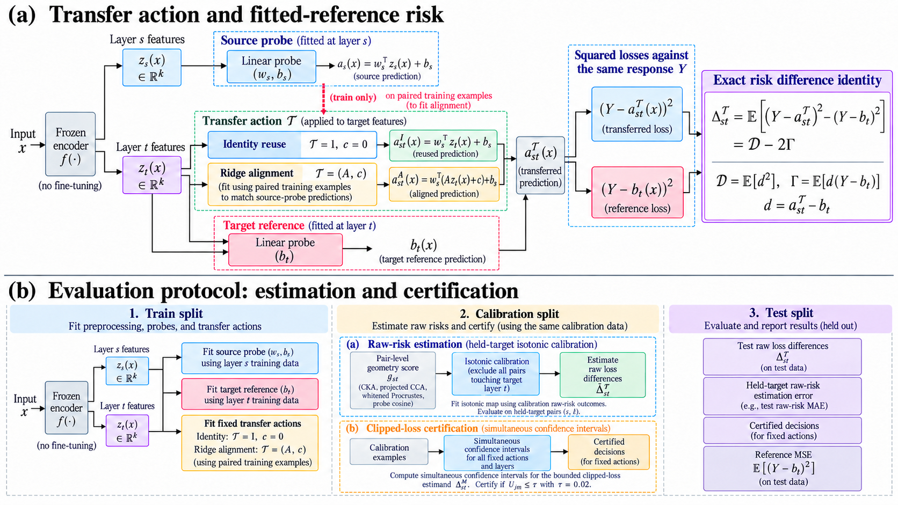
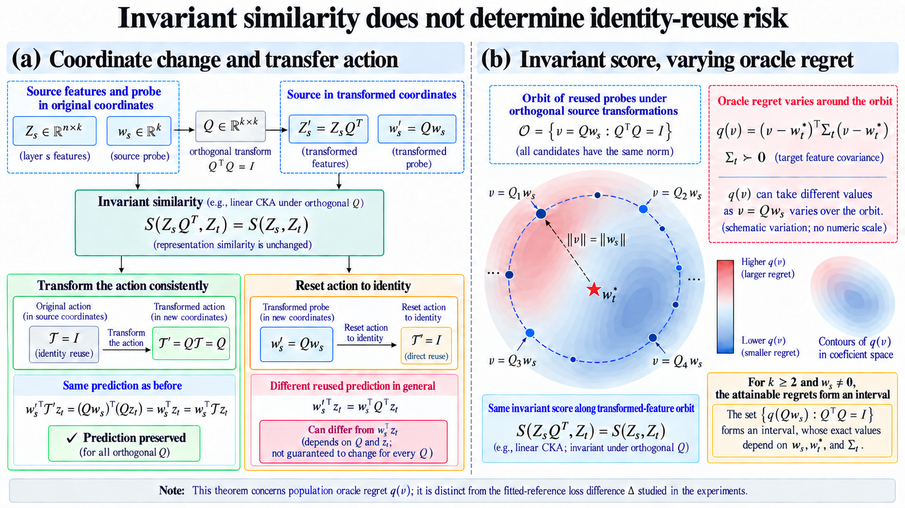
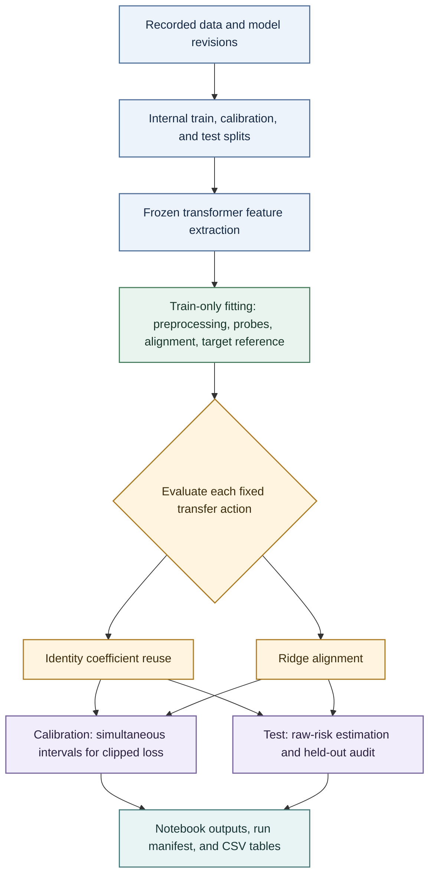
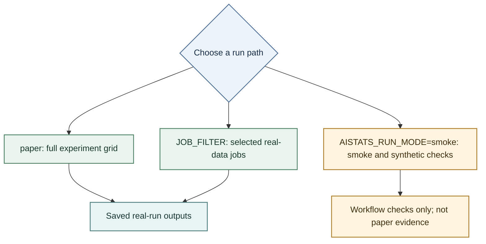

<p align="center">
  
</p>

<h1 align="center">When Can a Linear Probe Be Reused?</h1>

<p align="center"><strong>Geometry, Transfer Actions, and Risk Certification</strong></p>

[](https://www.python.org/)
[](https://jupyter.org/)
[](LICENSE)

Code and result artifacts for a study of transferring linear probes across layers of frozen transformer models.

[Overview](#overview) · [Figures](#figures) · [Results](#key-results) · [Experimental design](#experimental-design) · [Reproduction](#reproduce) · [Artifacts](#repository-map) · [Limitations](#interpretation-and-limitations)

## Overview

A representation-similarity score does not specify which coordinates or transfer rule to use when reusing a probe. This project studies two distinct actions:

- **Identity reuse:** apply the source probe’s coefficients directly to target-layer features.
- **Ridge alignment:** fit a linear map on paired target-training features to reproduce source-probe predictions.

Each transferred predictor is compared with a fitted target-layer reference. The study combines frozen-model features, train-only preprocessing, raw-risk estimation, an exact decomposition of prediction disagreement, and simultaneous held-out intervals for clipped-loss decisions.

The notebook contains the executable research workflow and saved outputs for the completed **v3 paper-profile run**. A separately marked v2 pilot section is retained for record-keeping; it is not evidence for the v3 findings.

## Figures

These figures explain the paper’s setup and theory. They are conceptual diagrams, not experimental result plots.

<p align="center">
  
</p>

<p align="center"><em>Transfer actions, training-fitted alignment, the target reference, and the separation between raw-risk estimation and clipped-loss certification.</em></p>

<p align="center">
  
</p>

<p align="center"><em>Score invariance can coexist with changing directional oracle regret under transformations. The contours are schematic and have no numeric scale; population oracle regret q differs from the fitted-reference loss difference Δ used in the experiments.</em></p>

## Research pipeline



## Key results

The primary certification results use centered/RMS features, a clipped-loss tolerance of **0.02**, and simultaneous predictable betting intervals.

| Model on SST-2 | Ridge-aligned decisions certified | Identity-reuse decisions certified |
|---|---:|---:|
| GPT-2 | 315/396 | 12/396 |
| BERT | 248/396 | 22/396 |

Each denominator represents 132 ordered layer pairs over three repeats. The repeats reuse a sampled pool, and the pair–split decisions are dependent; they are not 396 independent datasets.

### Raw-risk estimation

These MAEs are averaged over the three SST-2 splits. Geometry and direct training loss use the same training labels. The target is the final-test mean raw loss difference, which is noisy.

| Model / preprocessing | Geometry-based MAE | Direct-training MAE |
|---|---:|---:|
| GPT-2 / raw | 0.14616 | 0.14598 |
| GPT-2 / centered/RMS | 0.00581 | 0.00589 |
| BERT / raw | 0.17511 | 0.17558 |
| BERT / centered/RMS | 0.00945 | 0.00958 |

On these primary settings, geometry-based estimation is close to direct training loss. Larger gains in the small-sample sweep are descriptive.

### Domain transfer and bounded simulation

- **Domain transfer:** All 18 SST-2-to-IMDB/Allociné runs produce zero certifications per action at tolerance 0.02. Calibration uses target-domain data, so these results describe the evaluated transfer runs; they do not establish a source-calibrated guarantee under arbitrary distribution shift.
- **Bounded simulation:** Both interval methods cover both directional risks in all 1,000 repetitions at each calibration size, n = 128, 512, and 2,048. At n = 2,048, mean interval widths are 0.00707 for betting and 0.03430 for empirical Bernstein; certified fractions are 0.997 and 0. The simulation evaluates coverage and certification for the safe transfers it generates; it is not a mixed safe/unsafe stress test.

## Experimental design

| Component | Protocol |
|---|---|
| **Frozen models** | GPT-2, GPT-2 medium, Pythia-160m, and BERT-base |
| **Tasks** | SST-2; AG News Sports-versus-rest; CoLA; French Allociné sentiment; normalized next-token surprise; and SST-2-to-IMDB/Allociné domain transfer |
| **Feature extraction** | Transformer block outputs before terminal normalization; last non-padding token for decoder models and CLS for BERT; inputs truncated to 64 tokens |
| **Splits** | 12,000 training / 3,000 calibration / 3,000 test examples, except CoLA at 5,000 / 1,500 / 1,500 |
| **Primary preprocessing** | Native coordinates; pooled shared PCA; layerwise centering with shared PCA; and layerwise centering/RMS scaling with shared PCA |
| **PCA and probes** | Shared PCA dimension 128. Ridge probes use unpenalized intercepts and training-only generalized cross-validation for the penalty. Alignment uses η = 10⁻³. |
| **Uncertainty** | Simultaneous empirical Bernstein and predictable betting intervals for fixed transfer actions |

Examples are sampled from public training splits and repartitioned into internal benchmark splits; these are not official test-set results. The three primary repeats reuse the sampled pool.

Within-domain analyses include 132 distinct ordered layer pairs. Domain runs also include equal-index pairs, for 144 pairs. In domain runs, source preprocessing is frozen; alignment is fitted using paired target-training features and source-probe predictions. Target labels are used for the fitted reference heads, so these are not target-label-free domain-adaptation experiments.

Each preprocessing protocol fits its own transformations and heads using training data only. Therefore, shared-raw versus shared-RMS is a whole-pipeline comparison, not a fixed-basis intervention.

## Reproduce

### Environment

The recorded reference environment is:

- Python 3.12.13
- PyTorch 2.10.0+cu128
- NumPy 2.0.2
- SciPy 1.16.3
- pandas 2.3.3
- scikit-learn 1.6.1
- Matplotlib 3.10.0
- Transformers 5.0.0
- Datasets 5.0.0
- Hugging Face Hub 1.11.0

Install a PyTorch build compatible with your hardware using the official [PyTorch installation selector](https://pytorch.org/get-started/locally/), then install the remaining pinned dependencies:

```bash
python -m pip install -r requirements.txt
```

### Run paths



| Run path | Use | How to interpret it |
|---|---|---|
| `paper` | Run the full experiment grid | Full workflow; substantial runtime |
| `JOB_FILTER` | Run selected real-data jobs | A subset run, not the complete paper result |
| `AISTATS_RUN_MODE=smoke` | Check the smoke/synthetic path | Workflow check only; not real-model evidence |

### Run the notebook

1. Launch Jupyter and open `notebooks/main_experiment.ipynb`.
2. Keep the default `paper` profile for the full experiment grid.
3. Run all cells with internet access enabled. The notebook downloads the recorded datasets and model revisions.
4. For a smaller real-data subset, set `JOB_FILTER` in the first code cell, for example:

   ```python
   JOB_FILTER = {"gpt2_sst2"}
   ```

A GPU is recommended for feature extraction. The full paper run is substantial and has no single-session runtime guarantee. Feature caches and completed checkpoints are written under the notebook’s output root so staged runs can resume.

To exercise the smoke/synthetic path, set the environment variable before launching Jupyter:

```bash
AISTATS_RUN_MODE=smoke jupyter lab
```

Smoke-mode outputs are for workflow checks and must not be reported as real-model findings.

### Recover the saved tables

The notebook embeds the checksummed result-table bundle. Recover and verify its CSV files without rerunning the experiments:

```bash
python scripts/export_embedded_tables.py \
  notebooks/main_experiment.ipynb \
  --output-dir results/recovered_tables
```

## Repository map

- `notebooks/main_experiment.ipynb` — executed v3 workflow, code, figures, saved outputs, run manifest, and embedded result-table bundle.
- `figures/overview_transfer_actions.png` — conceptual overview of transfer actions and evidence.
- `figures/theory_invariance_oracle_regret.png` — conceptual illustration of score invariance and oracle-regret variation.
- `assets/readme_ticker.gif` — animated README header banner; decorative only, not a paper figure or experimental result.
- `tables/` — 17 curated CSV summaries from the supplied table export, with filenames preserved.
- `results/all_tables/` — 123 CSV tables recovered from the notebook bundle, including pair-level outputs. Two files are marked as v2 legacy pilot tables.
- `scripts/export_embedded_tables.py` — standard-library script for extracting and checksum-verifying the embedded tables.
- `requirements.txt` — pinned Python analysis dependencies; install the hardware-appropriate PyTorch build separately.
- `LICENSE` — MIT License.

The two diagrams in `figures/` are conceptual. Add experimental plots separately under their original filenames when they are ready.

## Data and model provenance

Dataset and model identifiers, resolved revisions, feature-extraction conventions, split hashes, and run configurations are recorded in the notebook’s embedded manifest and per-run metadata. The repository does not include raw datasets, pretrained weights, native activation caches, or a checkpoint archive. Review upstream dataset and model terms before reuse.

## Interpretation and limitations

- Certification is relative to the declared fitted target reference. It does not establish absolute task quality or raw-loss safety.
- Raw-risk estimation and clipped-loss certification are different quantities and should not be interpreted interchangeably.
- The separate within-Allociné centered/RMS run has a mean reference MSE of 0.24625 and accuracy of 54.53%; the constant-zero predictor has MSE 0.25 for the binary ±0.5 labels. A small relative loss difference alone is not evidence of useful sentiment prediction.
- The domain-transfer runs calibrate on target-domain data. Their results do not demonstrate robustness of a source-calibrated guarantee to arbitrary shift.
- The estimation MAEs use final-test mean raw differences as noisy targets. They are reported as diagnostics, not population guarantees.
- Most controls and sensitivity settings use one split. The three primary repeats share a sampled pool.

For full definitions, configurations, checks, and qualifications, consult the executed notebook and its run manifest.

## Double-blind release check

This README contains no author names, affiliations, or personal links. Before sharing a review copy, also check the repository owner and URL, commit history, profile links, notebook metadata, figure and file metadata, and license notices; any of these can reveal identity independently of the README. Use only an anonymized repository link during review.

## License and citation

The repository code and included diagrams are distributed under the MIT License. If you use the methods or results, cite the associated manuscript:

> *When Can a Linear Probe Be Reused? Geometry, Transfer Actions, and Risk Certification.*

Add the complete bibliographic record once it is public.
